```{r setup, include=FALSE}
knitr::opts_chunk$set(echo = TRUE)
```

As it so happens, there are at least 12 "Table 1" packages available. Each offers similar functions, with a few variations. I've provided a summary of each below, in an attempt to find a package that will provide me with the values (and hopefully also the layout) closest to the descriptives table I am trying to replicate for Paper 1.

A few things to note:
- Some of the table examples I have provided will contain data from Paper 1 I am examining, some have been taken from other sites.
- The last 6 (# 7 - 12) packages summarised below were found through the blog: https://thatdatatho.com/easily-create-descriptive-summary-statistic-tables-r-studio/

### 1. tableone
This is the package I used last week. 

Pros:
- Summarise continuous & categorical variables.
- Categorical variables can be summarised as counts and/or percentages.
- Continuous variables can be summarised "normally" (mean & SD) or "non-normally" (median & IQR).
- Allows for layout where descriptive statistics are displayed as individual columns & all experimental variables are displayed as individual rows.

Cons: 
- No function for range.
- Cannot customise the design of the table (e.g., in a style resembling APA format).

Here is how descriptives are shown in tableone using the data from Paper 1:

```{r out.width = "50%"}

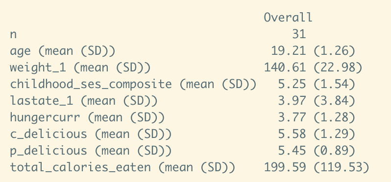
```

See - https://cran.r-project.org/web/packages/tableone/vignettes/introduction.html

### 2. table1
Presents descriptive statistics of the study population stratified by treatment condition.

Pros:
- HTML output that can be used with knitr and Rmd without being affected.
- Flexibility to customise (to some extent) table contents & layout.
- Can request different statistics for specific variables (e.g., median & range for age; mean & SD for weight).

Cons:
- Cannot change the layout of the table so each column represents a descriptive statistic.

```{r out.width = "50%"}

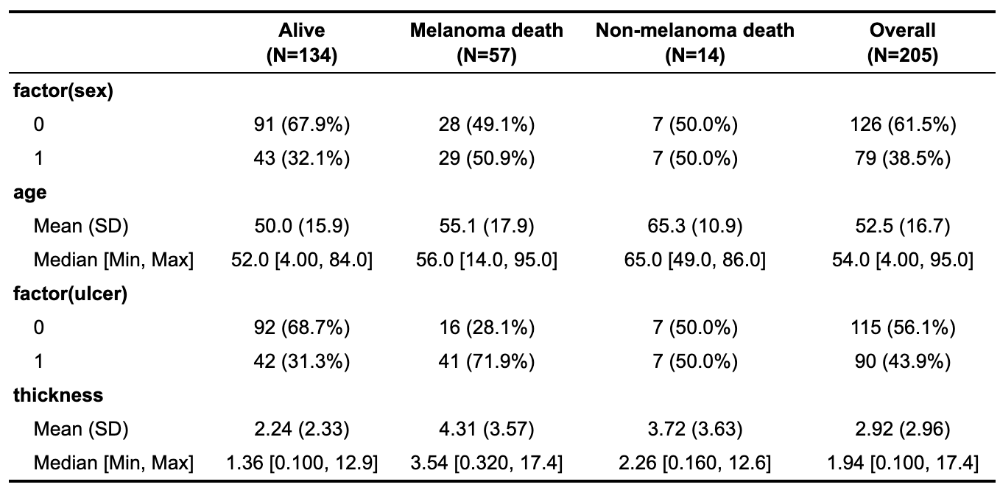
```

Note: the above table is taken from the CRAN vignette, as the Paper 1 data is messy when displayed in this kind of table.

See - https://cran.r-project.org/web/packages/table1/vignettes/table1-examples.html

### 3. TableOne
Not much information is available on this package; all Git data was last updated 2 years ago. 

Pros:
- Specific functions for summarising and presenting dichotomous, ordinal and continuous data.

Cons:
- The package appears to be quite limited in functionality.
- Only accepts data directly from an Excel document.
- Not yet available through CRAN.

See - https://github.com/agapiospanos/TableOne

### 4. Table1

Pros:
- (make.table) can be outputted as PDF, HTML or printed to R console.
- Optional inputs for headers, row names, summary statistics, etc. to customise the output.
- Table can be stratified by one or more variables.
- Quicker alternative (quick.table) classifies variables as categorical/continuous and generates a set of summary statistics for all available variables.

Cons:
- Cannot change the layout of the table so each column represents a descriptive statistic.
- Not available through CRAN.

```{r out.width = "50%"}

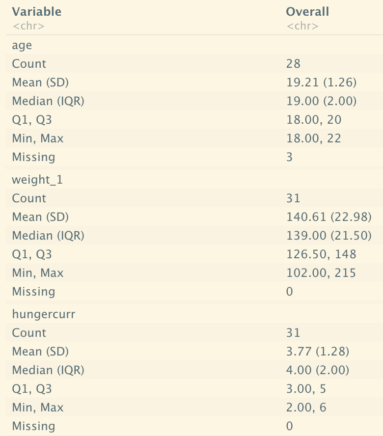
```

See - https://rpubs.com/emwozniak/195942

### 5. Furniture (table1)
Provides a simple summary table with means/counts and SDs/percentages.

Pros:
- Uses a similar API to tidyverse groups and can be used in a pipe.
- Provides bivariate test results for variable with grouping variable.
- Flexible output: printed in console output, in latex (e.g., through kable), markdown and pandoc.
- Can be exported to CSV.

Cons:
- A little too simplistic; no clear row or column labels, no option for HTML format, limited ability to customise layout.

```{r out.width = "50%"}

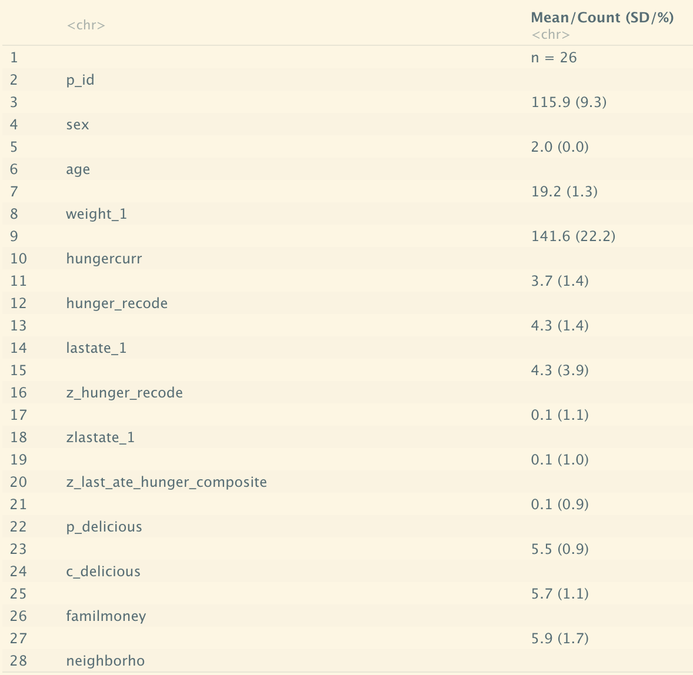
```

See - https://cran.r-project.org/web/packages/furniture/vignettes/Table1.html

### 6. apaTables
Produces tables that conform to APA style for several different types of analyses, e.g., correlation, ANOVA.

Pros:
- Automates the process by which tables are created from analyses using R.
- Ensures the tables are reproducible.

Cons:
- Functions are restricted to specific analyses; limited ability to custome layout. 
- Package is for tables generated from analyses only; no specific table for descriptives, although correlation or one-way ANOVA table functions will produce a descriptives table (showing mean and SD only).

```{r out.width = "50%"}

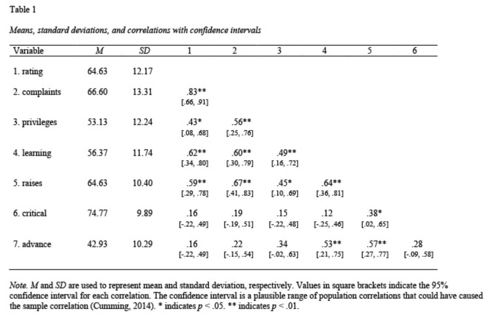
```
Note: the above table is taken from the CRAN vignette.

See - https://cran.r-project.org/web/packages/apaTables/index.html

### 7. arsenal
Comprises 6 functions designed to make statistical reporting easy. The relevant function for Table 1 is tableby(), which summarises a set of independent variables by one or more categorical variables. 

Pros:
- Lots of functionality: can customise most any aspect of the table.
- Requires very little code, e.g., can create a table using only two lines of code.
- Can stratify table by more than one grouping variable.
- Can create a very simple table without any groupings.

Cons:
- None that I am aware of at this stage!

```{r out.width = "50%"}

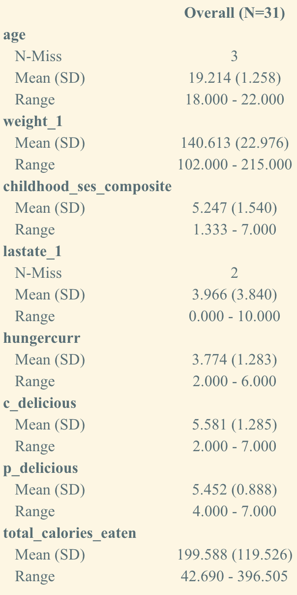
```

See - https://cran.r-project.org/web/packages/arsenal/index.html

### 8. qwraps2
Comprises numerous functions to summarise data and format results. These functions, or similar, can be found in other R packages.

Pros:
- Extremely flexible; can customise every single line of a summary table.
- Formatting tools, e.g., summary_table() for data summary tables in markdown; mean_sd, mean_ci for reporting formatted summary statistics.
- Plotting tools, e.g., ggplot2_extract_legend() to extract the legend from a ggplot.

Cons:
- Long lines of code.

```{r out.width = "50%"}

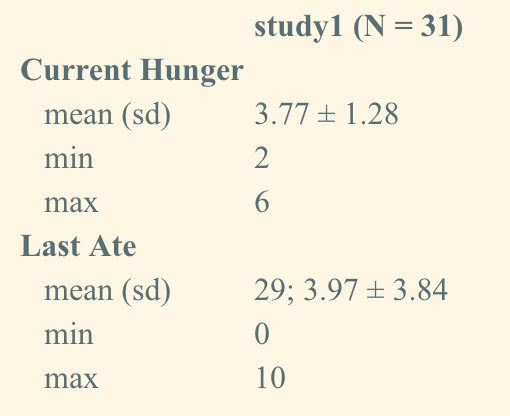
```

See - https://cran.r-project.org/web/packages/qwraps2/index.html

### 9. amisc
Little information on this package as it is currently only available on GitHub. 

Pros:
- Produces a simple summary table showing key descriptives, e.g., mean, median, IQR, etc.
- Uses pandoc.table() function to create a tidy, comprehensible table.

Cons:
- Rather a basic package with little functionality.

See - https://github.com/ablejec/amisc

```{r out.width = "50%"}

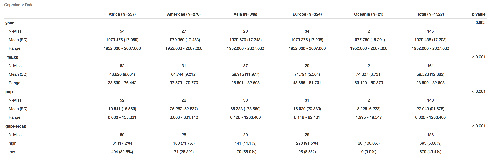
```

Note: above image is taken from https://thatdatatho.com/easily-create-descriptive-summary-statistic-tables-r-studio/

### 10. tangram
"A grammar of tables"; essentially a list of lists comprising cells that can be subclassed from almost anything.

Pros:
- Nice aesthetics; short code.
- High fuctionality.
- Two types of style: one is internal to a cell and its formatting of text; the other is the overall styling of a table.

Cons:
- Only knits to HTML.
- Table does not show missing values by default.

See - https://cran.r-project.org/web/packages/tangram/index.html

```{r out.width = "50%"}

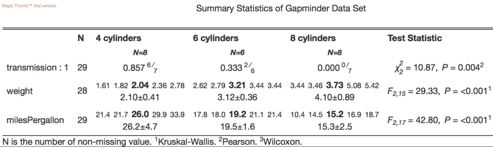
```

Note: above image is taken from https://thatdatatho.com/easily-create-descriptive-summary-statistic-tables-r-studio/

### 11. compareGroups

Pros:
- Can create tables showing results of univariate analyses, stratified or not be categorical variable groupings.
- Tables can be exported to csv, HTML, PDF, Word, xlsx, or inserted in R-markdown files.
- Three main functions:
  1) compareGroups creates an object that can be printed, summarised, plotted or updated
  2) createTable creates an object that can be printed or summarised
  3) export2csv, export2html, etc. will export results to csv, HTML, etc.
- Quite simple to use.
- Function descrTable builds descriptive statistics in a single step.

Cons:
- Doesn't display missing values by default.

```{r out.width = "50%"}

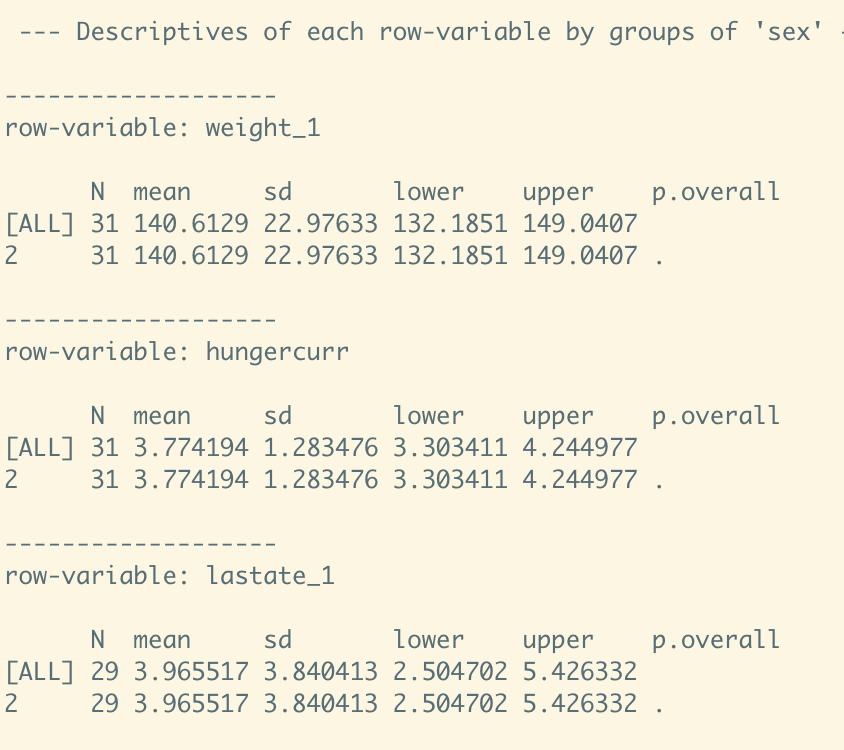
```

See - https://cran.r-project.org/web/packages/compareGroups/vignettes/compareGroups_vignette.html

### 12. gmisc
A tool for producing "Table 1", a transition plot displaying changes between categories, flow charts and a method for variable selection.

Pros:
- getDescriptionStatsBy function returns everything you need to generate a descriptive table stratified by different variables.
- mergeDesc function allows you to merge a set of outputs into a htmlTable.
- Easy to re-label variables.

Cons:
- Table can only be created in an HTML file.
- Long lines of code.

See - https://cran.r-project.org/web/packages/Gmisc/index.html

```{r out.width = "50%"}

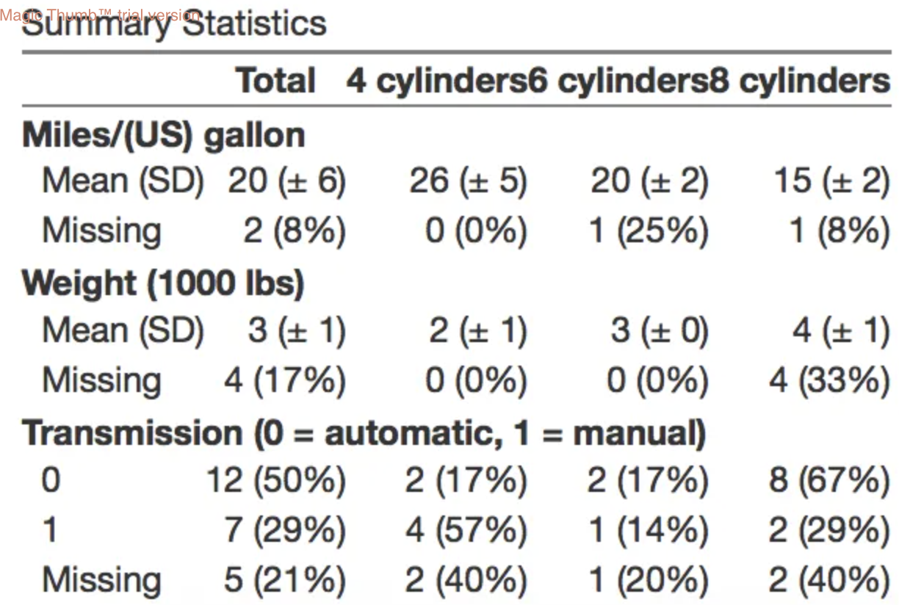
```

Note: above image is taken from https://thatdatatho.com/easily-create-descriptive-summary-statistic-tables-r-studio/

### Decision

Based on the above, I think arsenal is the best package for replicating Table 1 from Paper 1. It will certainly be helpful to have this summary to refer to, though, as the tables for the other papers may be better served by another package!
